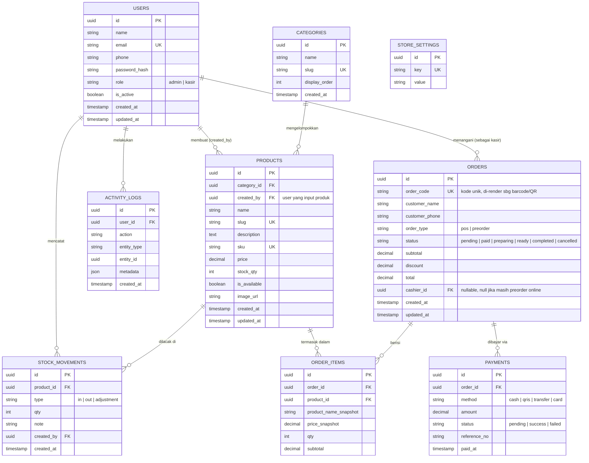

# ERD.md — Skema Database KAYA Bakery

## 1. Diagram Relasi (Mermaid)



---

## 2. Penjelasan Tiap Tabel

### `users`
Akun **Admin** dan **Kasir** saja. Publik tidak punya baris di tabel ini.
- `role`: enum string `admin` atau `kasir`.
- Akun kasir **hanya bisa dibuat oleh admin** (tidak ada endpoint self-register).
- `is_active`: dipakai admin untuk menonaktifkan akun kasir tanpa menghapus data historis
  (karena `cashier_id` di `orders` masih mereferensikan user ini).

### `categories`
Kategori produk, misal: Roti Tawar, Roti Manis, Pastry, Kue, Minuman.

### `products`
Katalog roti/produk.
- `created_by`: mencatat siapa yang input produk ini (bisa admin atau kasir — lihat
  `ROLES.md` soal siapa boleh apa).
- `stock_qty`: jumlah stok saat ini. Perubahan stok **selalu** juga dicatat di
  `stock_movements` untuk audit trail (jangan update `stock_qty` tanpa insert movement).
- `is_available`: toggle cepat untuk sembunyikan produk dari katalog publik tanpa hapus data.

### `orders`
Satu baris = satu transaksi/pesanan, baik dari POS (kasir input langsung) maupun
preorder online dari publik.
- `order_code`: **kode unik yang di-generate backend**, dipakai untuk render barcode/QR.
  Format disarankan: `KYA-YYYYMMDD-XXXX` (contoh: `KYA-20260812-0417`). Ini adalah
  "barcode pembeli" yang dimaksud — bukan barcode produk.
- `order_type`:
  - `pos` → dibuat langsung oleh kasir di toko, `cashier_id` terisi sejak awal.
  - `preorder` → dibuat oleh publik lewat landing page, `cashier_id` null sampai
    kasir memprosesnya (scan barcode saat pembeli datang).
- `status` lifecycle: `pending → paid → preparing → ready → completed`
  (atau `cancelled` di titik manapun sebelum `completed`).

### `order_items`
Detail item per pesanan. Menyimpan **snapshot** nama & harga produk saat transaksi
(`product_name_snapshot`, `price_snapshot`) supaya riwayat pesanan tidak berubah
walaupun harga produk di master data diubah admin di kemudian hari.

### `payments`
Catatan pembayaran per pesanan. Dipisah dari `orders` supaya bisa mendukung
pembayaran parsial/multi-metode di masa depan tanpa ubah skema `orders`.

### `stock_movements`
Audit trail perubahan stok. Setiap kali stok bertambah (restock) atau berkurang
(terjual/rusak), insert baris baru di sini. `type`:
- `in` — restock/tambah stok baru
- `out` — stok keluar (biasanya otomatis saat order `paid`)
- `adjustment` — koreksi manual oleh admin (misal setelah stock opname)

### `activity_logs`
Log aktivitas untuk kebutuhan **monitoring admin** (sesuai requirement "admin untuk
memonitor"). Contoh `action`: `"created_product"`, `"updated_price"`, `"processed_order"`.
`entity_type` + `entity_id` menunjuk ke record yang terpengaruh.

### `store_settings`
Tabel key-value sederhana untuk pengaturan toko yang dikelola admin, misal:
`store_name`, `store_open_time`, `store_close_time`, `store_address`,
`whatsapp_number`, `min_preorder_hours`. Desain key-value dipilih supaya gampang
menambah setting baru tanpa migration.

---

## 3. Index yang Disarankan

```sql
CREATE INDEX idx_products_category_id ON products(category_id);
CREATE INDEX idx_products_is_available ON products(is_available);
CREATE UNIQUE INDEX idx_orders_order_code ON orders(order_code);
CREATE INDEX idx_orders_status ON orders(status);
CREATE INDEX idx_orders_cashier_id ON orders(cashier_id);
CREATE INDEX idx_order_items_order_id ON order_items(order_id);
CREATE INDEX idx_stock_movements_product_id ON stock_movements(product_id);
CREATE INDEX idx_activity_logs_user_id ON activity_logs(user_id);
```

---

## 4. Contoh GORM Struct (Go)

Referensi awal untuk `internal/models/` — agent boleh menyesuaikan tag sesuai
konvensi final, tapi nama field & relasi harus konsisten dengan ERD di atas.

```go
package models

import (
    "time"
    "github.com/google/uuid"
)

type User struct {
    ID           uuid.UUID `gorm:"type:uuid;primaryKey;default:gen_random_uuid()"`
    Name         string    `gorm:"not null"`
    Email        string    `gorm:"uniqueIndex"`
    Phone        string
    PasswordHash string    `gorm:"not null"`
    Role         string    `gorm:"not null"` // "admin" | "kasir"
    IsActive     bool      `gorm:"default:true"`
    CreatedAt    time.Time
    UpdatedAt    time.Time
}

type Category struct {
    ID            uuid.UUID `gorm:"type:uuid;primaryKey;default:gen_random_uuid()"`
    Name          string    `gorm:"not null"`
    Slug          string    `gorm:"uniqueIndex;not null"`
    DisplayOrder  int
    CreatedAt     time.Time
}

type Product struct {
    ID           uuid.UUID `gorm:"type:uuid;primaryKey;default:gen_random_uuid()"`
    CategoryID   uuid.UUID
    Category     Category
    CreatedByID  uuid.UUID
    CreatedBy    User      `gorm:"foreignKey:CreatedByID"`
    Name         string    `gorm:"not null"`
    Slug         string    `gorm:"uniqueIndex;not null"`
    Description  string
    SKU          string    `gorm:"uniqueIndex"`
    Price        float64   `gorm:"not null"`
    StockQty     int       `gorm:"default:0"`
    IsAvailable  bool      `gorm:"default:true"`
    ImageURL     string
    CreatedAt    time.Time
    UpdatedAt    time.Time
}

type Order struct {
    ID              uuid.UUID `gorm:"type:uuid;primaryKey;default:gen_random_uuid()"`
    OrderCode       string    `gorm:"uniqueIndex;not null"`
    CustomerName    string    `gorm:"not null"`
    CustomerPhone   string
    OrderType       string    `gorm:"not null"` // "pos" | "preorder"
    Status          string    `gorm:"not null;default:pending"`
    Subtotal        float64
    Discount        float64   `gorm:"default:0"`
    Total           float64
    CashierID       *uuid.UUID
    Cashier         *User     `gorm:"foreignKey:CashierID"`
    Items           []OrderItem
    Payments        []Payment
    CreatedAt       time.Time
    UpdatedAt       time.Time
}

type OrderItem struct {
    ID                   uuid.UUID `gorm:"type:uuid;primaryKey;default:gen_random_uuid()"`
    OrderID              uuid.UUID
    ProductID            uuid.UUID
    ProductNameSnapshot  string
    PriceSnapshot        float64
    Qty                  int
    Subtotal             float64
}

type Payment struct {
    ID            uuid.UUID `gorm:"type:uuid;primaryKey;default:gen_random_uuid()"`
    OrderID       uuid.UUID
    Method        string // "cash" | "qris" | "transfer" | "card"
    Amount        float64
    Status        string // "pending" | "success" | "failed"
    ReferenceNo   string
    PaidAt        *time.Time
}

type StockMovement struct {
    ID          uuid.UUID `gorm:"type:uuid;primaryKey;default:gen_random_uuid()"`
    ProductID   uuid.UUID
    Type        string // "in" | "out" | "adjustment"
    Qty         int
    Note        string
    CreatedByID uuid.UUID
    CreatedAt   time.Time
}

type ActivityLog struct {
    ID         uuid.UUID `gorm:"type:uuid;primaryKey;default:gen_random_uuid()"`
    UserID     uuid.UUID
    Action     string
    EntityType string
    EntityID   uuid.UUID
    Metadata   string // JSON string
    CreatedAt  time.Time
}

type StoreSetting struct {
    ID    uuid.UUID `gorm:"type:uuid;primaryKey;default:gen_random_uuid()"`
    Key   string    `gorm:"uniqueIndex;not null"`
    Value string
}
```
