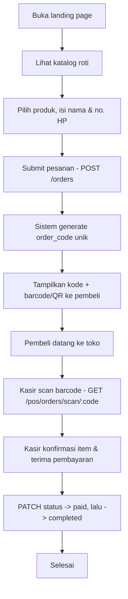
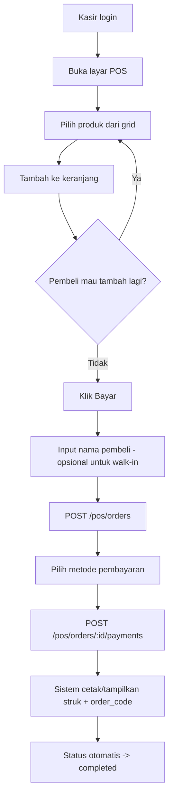
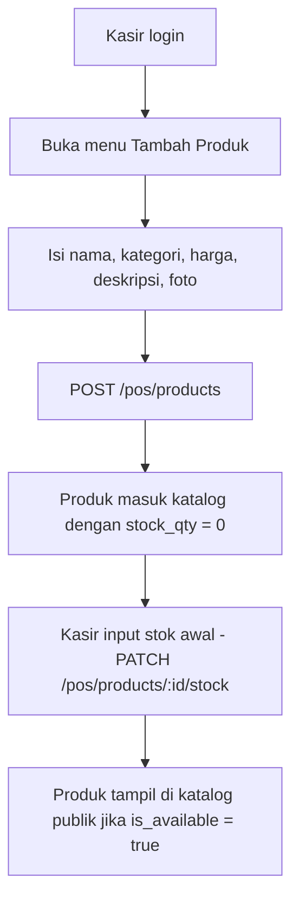
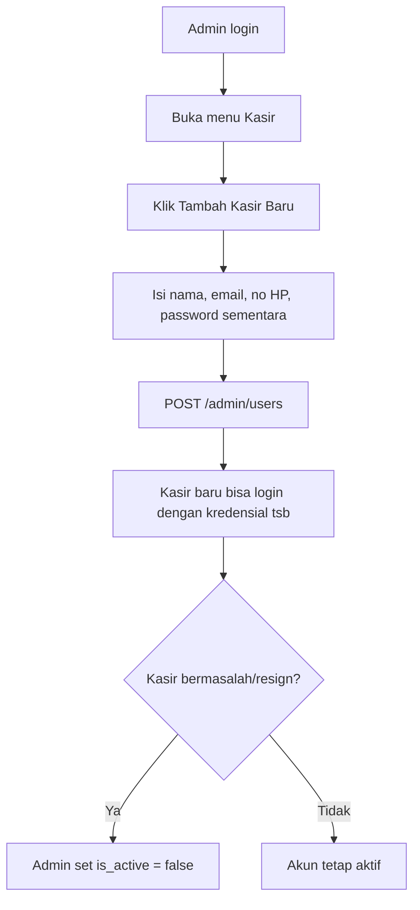
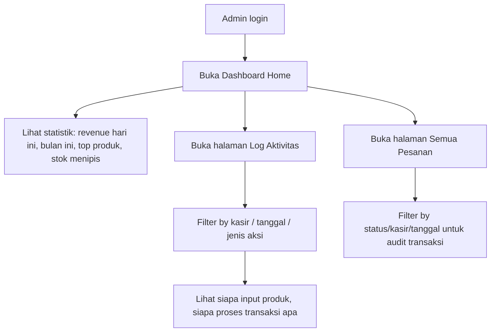
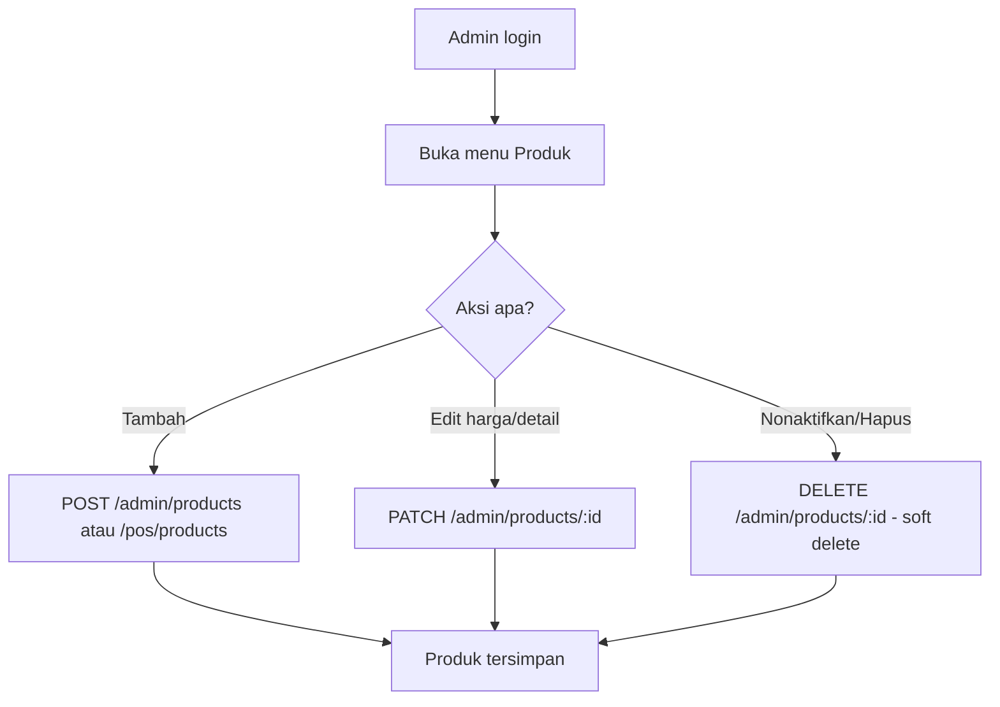

# USER-FLOWS.md — Alur Penggunaan KAYA Bakery

## 1. Alur Publik — Pre-order Online & Ambil di Toko

**Detail:**
- Kode pesanan (`order_code`) ditampilkan sebagai barcode/QR di halaman konfirmasi
  setelah submit, dan pembeli bisa screenshot atau catat kodenya.
- Pembeli bisa cek status kapan saja lewat halaman `order-status.html` dengan
  memasukkan `order_code` secara manual (`GET /orders/:order_code`).
- Tidak ada login/akun sama sekali di sepanjang flow ini.

---

## 2. Alur Kasir — Transaksi Walk-in (POS)

**Detail:**
- Untuk transaksi walk-in, nama pembeli **opsional** (bisa diisi "Guest" default)
  karena pembeli langsung bayar di tempat, beda dengan preorder yang butuh nama
  untuk identifikasi saat pengambilan nanti.
- `order_type = "pos"`, `cashier_id` otomatis terisi dari token JWT kasir yang login.

---

## 3. Alur Kasir — Input Roti Baru

**Detail:**
- Produk baru dari kasir langsung masuk database, **tidak perlu approval admin**
  (sesuai requirement awal). Tapi tercatat di `activity_logs` supaya admin tetap
  bisa memonitor siapa yang menambahkan apa.
- Kalau nanti kamu mau ada approval sebelum tampil publik, tinggal tambah field
  `is_approved` di `products` — perubahan kecil, tidak mengubah struktur besar.

---

## 4. Alur Admin — Kelola Akun Kasir

---

## 5. Alur Admin — Monitoring & Statistik

---

## 6. Alur Admin — Kelola Produk (Full Control)

---

## 7. Ringkasan Titik Kritis untuk Agent Saat Build

1. **Barcode hanya untuk pesanan**, bukan untuk produk (produk pakai `SKU` biasa jika
   perlu). Jangan tertukar dengan sistem scan barcode ala supermarket per-item.
2. **Guest checkout wajib tanpa friction** — jangan tambahkan requirement password/
   OTP/email verifikasi di flow publik, itu di luar scope v1.
3. **Setiap perubahan data oleh admin/kasir harus tercatat di `activity_logs`** —
   ini requirement inti untuk fitur monitoring admin.
4. **Stok berkurang otomatis saat order berstatus `paid`** (bukan saat `pending`),
   supaya stok tidak "terkunci" oleh pesanan yang belum dibayar.
